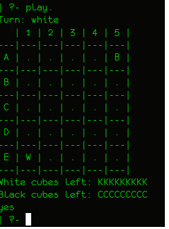
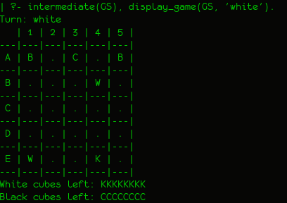
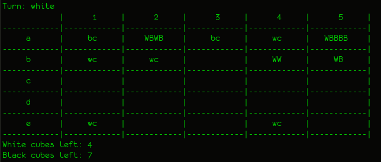

# Relatório Intercalar
## MIEIC-PLOG

João Pedro Olinto Dossena (UP201800174)  
João Francisco Ribeiro dos Santos (UP201707427)  
Turma: 7  
Grupo: Nava_3  

## Nava

# MUDAR OS + e os - !!!!!!!!!!!

### Instruções de execução
1. Abrir o terminal com o SICSTUS instalado
2. Executar o comando "sicstus"
3. Executar o comando " ['nava.pl']." ou "consult('nava.pl')."
4. Executar o predicado "play."

### Descrição do Jogo
#### Início
Estamos a implementar a versão de 2 jogadores de Nava, adaptando o tabuleiro para casas por simplicidade. Um dos jogadores terá peças brancas (o primeiro a jogar), e o outro terá peças pretas. Ambos começam com uma pilha de 6 peças redondas em cantos opostos de um tabuleiro 5x5, e com 9 peças cúbicas fora do tabuleiro.
#### Jogadas
A cada jogada, o jogador deverá retirar um número X de seus discos do topo de uma das suas pilhas, e movê-los em linha reta (sem ser diagonal), colocando essa subpilha a X casas de distância (sendo X limitado pelo número de casas no tabuleiro, e pelo número de peças na pilha).
#### Pilhas
Se um jogador A mover sua pilha para cima de uma pilha de um jogador B, essa pilha agora é controlada pelo jogador A (podendo este dividí-la da maneira que quiser). Ou seja, uma pilha é controlada pelo dono da peça que está no topo. Isso significa que, ao fazer uma subsequente divisão de uma pilha, o jogador A pode acabar por criar uma pilha controlada pelo jogador B.
#### Criação de cubos
Se um jogador remover uma pilha inteira de uma casa, deixando-a vazia, ele deverá colocar um de seus cubos nessa casa.
#### Remoção de cubos
Se um jogador colocar uma pilha numa casa onde há um cubo, ele deverá devolver o cubo para o dono, e colocar sua pilha normalmente (inclusive se o cubo for dele próprio).
#### Término do jogo
Há duas formas de se ganhar: obtendo-se controlo de todas as pilhas adversárias, ou colocando-se no tabuleiro todos os seus 9 cubos. 

##### Mais informações
- [Página oficial do jogo](https://boardgamegeek.com/boardgame/250491/nava)  
- [Livro de regras](./Nava_Final_Rule_Sheet_-_David_Cordell.pdf)

### Representação interna do estado do jogo

#### Estado Inicial
No tabuleiro inicial estarão os dois jogadores com as pilhas de 6 discos em cantos opostos. Seus cubos estarão fora do tabuleiro

O predicado initialBoard/1 possui uma lista (matriz) de listas (linhas) de listas (pilhas). Ele representa a configuração inicial do tabuleiro:

	initialBoard([
		[[], [], [], [], [black, black, black, black, black, black]],
		[[], [], [], [], []],
		[[], [], [], [], []],
		[[], [], [], [], []],
		[[white, white, white, white, white, white], [], [], [], []]
	]).

Os predicados initialWhiteCubes/1 e initialBlackCubes/1 representam, respectivamente, os cubos brancos e pretos fora do tabuleiro, ou seja, a configuração inicial dos cubos:

	initialWhiteCubes(9).
	initialBlackCubes(9).

#### Estado Intermédio
O predicado midBoard/1 é análogo ao initialBoard/1, porém representa um determinado tabuleiro ao meio do jogo:

	midBoard([
    [[black, black],        [], [blackCube], [],                  [black, black, black, black]],
    [[],                    [], [],         [white, white, white], [],
    [[],                    [], [],          [],                  [],
    [[],                    [], [],          [],                  [],
    [[white, white, white], [], [[]],        [whiteCube],       	  []
    ]).

Analogamente temos os predicados midWhiteCubes/1 e midBlackCubes/1, que representam os cubos fora do tabuleiro ao meio do jogo:

	midWhiteCubes(8).
	midBlackCubes(8).

#### Estado Final
O predicado finalBoard/1 representa um determinado fim de jogo, no qual o jogador de peças brancas ganha por tomar o controlo de todas as pilhas do jogo:

	finalBoard([
    [[blackCube], [white, black, white, black], [blackCube],   [whiteCube],           [white, black, black, black, black]],
    [[whiteCube], [whiteCube],                  [],            [white, white],                             [white, black]],
    [[],          [],                           [],            [],                                                     []],
    [[],          [],                           [],            [],                                                     []],
    [[whiteCube], [],                           [],            [whiteCube],                                            []]
    ]).

Temos também os predicados finalWhiteCubes/1 e finalBlackCubes/1, representando os cubos que sobraram fora do tabuleiro ao final do jogo:

	finalWhiteCubes(4).
	finalBlackCubes(7).

### Visualização do estado de jogo
O predicado play/0 chama os predicados initial(+GameState), que inicializa o tabuleiro e as listas de cubos fora do tabuleiro, e display_game(-GameState, -Player), que, por sua vez, chama printBoard(-Board) e printCubes(-WhiteCubeList, -BlackCubeList). O predicado printBoard/1 imprime no ecrã o tabuleiro com o topo de cada stack ('W' para branco e 'B' para preto), bem como os cubos que estejam no tabuleiro ('K' para branco e 'C' para preto). O predicado printCubes/2 imprime no ecrã os cubos não usados.

#### Exemplos

##### Estado Inicial

##### Estado Intermediário

##### Estado Final

