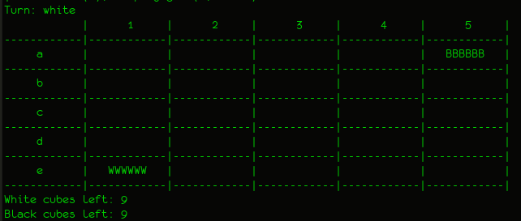
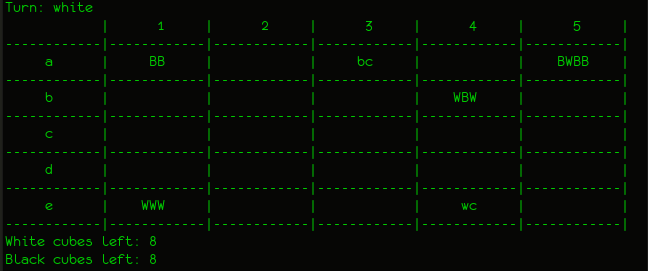
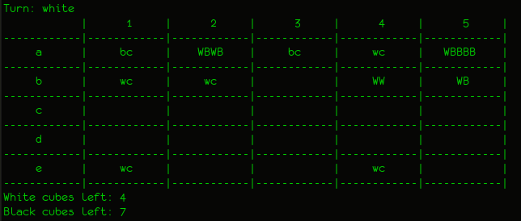

# Relatório Final
## MIEIC-PLOG

João Pedro Olinto Dossena (UP201800174)  
João Francisco Ribeiro dos Santos (UP201707427)  
Turma: 7  
Grupo: Nava_3  

Distribuição: 
  - Primeira Entrega: João Dossena 100%, João Francisco 0%
  - Segunda Entrega: João Dossena 100%, João Francisco 0%

## Nava

### Instruções de execução
1. Abrir o terminal com o SICSTUS instalado
2. Executar o comando "sicstus"
3. Executar o comando " ['nava.pl']." ou "consult('nava.pl')."
4. Executar o predicado "play."

### Descrição do Jogo
#### Início
Estamos a implementar a versão de 2 jogadores de Nava, adaptando o tabuleiro para casas por simplicidade. Um dos jogadores terá peças brancas (o primeiro a jogar), e o outro terá peças pretas. Ambos começam com uma pilha de 6 peças redondas em cantos opostos de um tabuleiro 5x5, e com 9 peças cúbicas fora do tabuleiro.
#### Jogadas
A cada jogada, o jogador deverá retirar um número X de seus discos do topo de uma das suas pilhas, e movê-los em linha reta (sem ser diagonal), colocando essa subpilha a X casas de distância (sendo X limitado pelo número de casas no tabuleiro, e pelo número de peças na pilha).
#### Pilhas
Se um jogador A mover sua pilha para cima de uma pilha de um jogador B, essa pilha agora é controlada pelo jogador A (podendo este dividí-la da maneira que quiser). Ou seja, uma pilha é controlada pelo dono da peça que está no topo. Isso significa que, ao fazer uma subsequente divisão de uma pilha, o jogador A pode acabar por criar uma pilha controlada pelo jogador B.
#### Criação de cubos
Se um jogador remover uma pilha inteira de uma casa, deixando-a vazia, ele deverá colocar um de seus cubos nessa casa.
#### Remoção de cubos
Se um jogador colocar uma pilha numa casa onde há um cubo, ele deverá devolver o cubo para o dono, e colocar sua pilha normalmente (inclusive se o cubo for dele próprio).
#### Término do jogo
Há duas formas de se ganhar: obtendo-se controlo de todas as pilhas adversárias, ou colocando-se no tabuleiro todos os seus 9 cubos. 

##### Mais informações
- [Página oficial do jogo](https://boardgamegeek.com/boardgame/250491/nava)  
- [Livro de regras](./Nava_Final_Rule_Sheet_-_David_Cordell.pdf)

### Representação interna do estado do jogo

#### Estado Inicial
No tabuleiro inicial estarão os dois jogadores com as pilhas de 6 discos em cantos opostos. Seus cubos estarão fora do tabuleiro

O predicado initialBoard/1 representa a configuração inicial do tabuleiro:

	initialBoard([
		[[], [], [], [], [black, black, black, black, black, black]],
		[[], [], [], [], []],
		[[], [], [], [], []],
		[[], [], [], [], []],
		[[white, white, white, white, white, white], [], [], [], []]
	]).

Os predicados initialWhiteCubes/1 e initialBlackCubes/1 representam a configuração inicial dos cubos:

	initialWhiteCubes(9).
	initialBlackCubes(9).

#### Estado Intermédio
O predicado midBoard/1 é análogo ao initialBoard/1, porém representa um determinado tabuleiro ao meio do jogo:

	midBoard([
    [[black, black],        [], [blackCube], [],                    [black, black, black, black]],
    [[],                    [], [],          [white, white, white], [],
    [[],                    [], [],          [],                    [],
    [[],                    [], [],          [],                    [],
    [[white, white, white], [], [],        [whiteCube],       	[]
    ]).

Analogamente temos os predicados midWhiteCubes/1 e midBlackCubes/1, que representam os cubos fora do tabuleiro ao meio do jogo:

	midWhiteCubes(8).
	midBlackCubes(8).

#### Estado Final
O predicado finalBoard/1 representa um determinado fim de jogo, no qual o jogador de peças brancas ganha por tomar o controlo de todas as pilhas do jogo:

	finalBoard([
    [[blackCube], [white, black, white, black], [blackCube],   [whiteCube],   [white, black, black, black, black]],
    [[whiteCube], [whiteCube],                  [],            [white, white],                     [white, black]],
    [[],          [],                           [],            [],                                             []],
    [[],          [],                           [],            [],                                             []],
    [[whiteCube], [],                           [],            [whiteCube],                                    []]
    ]).

Temos também os predicados finalWhiteCubes/1 e finalBlackCubes/1, representando os cubos que sobraram fora do tabuleiro ao final do jogo:

	finalWhiteCubes(4).
	finalBlackCubes(7).

### Visualização do estado de jogo
No início há um menu para que o usuário escolha e quer jogar contra uma pessoa, um bot fácil ou um bot mais difícil, ou se quer fazer os bots jogarem entre si.  

O predicado play/0 chama os predicados initial(-GameState), que inicializa o tabuleiro e os números de cubos fora do tabuleiro, e display_game(+GameState, +Player), que, por sua vez, chama printBoard(+Board) e printCubes(+WhiteCubeLeft, +BlackCubeLeft). O predicado printBoard/1 imprime no ecrã o tabuleiro com as peças de cada stack ('W' para branco e 'B' para preto), bem como os cubos que estejam no tabuleiro ('wc' para branco e 'bc' para preto). O predicado printCubes/2 imprime no ecrã os cubos não usados.

### Lista de Jogadas Válidas
O predicado valid_moves/3 recebe um estado de jogo, um jogador, e retorna uma lista de jogadas válidas. Ele faz isso por meio de um findall, que, com betweens, gera números válidos dentro do tabuleiro para Rows e Columns. Depois, verifica se os moves seriam válidos pelo predicado validMove/4, que tem a lógica de jogo implementada. Ele só permite que se mova peças no controlo do jogador da vez, e com uma distância menor ou igual ao tamanho da pilha.

### Execução de Jogadas
Para a validação de jogadas, apenas se verifica se a jogada pretendida é member da lista de jogadas válidas. Para mover, primeiro verifica-se a distância do movimento, para saber quantas peças retirar do topo da pilha. Depois, faz-se split da pilha. É feito um replace com a subpilha inferior para atualizar o board. Se houver um cubo na casa nova pretentida, é retirado. Move-se a subpilha superior à nova casa (append), e faz-se replace novamente. No fim, verifica-se se a casa antiga ficou vazia. Caso esteja vazia, coloca-se lá um cubo.

### Final do Jogo
O predicado game_over/2 chama um predicado checkForWinner/2, que verifica se o jogador já colocou todos os seus cubos no tabuleiro, ou se capturou todas as peças inimigas. Unifica com o jogador que tiver ganho o jogo.

### Avaliação do Tabuleiro
O predicado value/3 retorna um valor para um determinado estado de jogo e jogador, composto por:
  - Número de peças próprias livres (PPL)
  - Número de peças inimigas livres (PIL)
  - Número de cubos próprios restantes (CPR)
  - Número de cubos inimigos restantes (CIR)

E é calculado da seguinte forma: Value = (CPR * PPL^2)/(CIR * PIL^2 + 1). Dessa forma é possível avaliar quais jogadas são mais preferíveis.

### Jogada do Computador
O predicado choose_move/4 possui duas versões: uma para um nível com um bot fácil, e outra para um bot mais difícil. Para o bot fácil, ele apenas escolhe uma jogada aleatoriamente da lista de jogadas válidas. O bot mais inteligente avalia todas as jogadas possíveis com o predicado value/3, dá sort, reverse, e então escolhe a jogada com maior valor (primeiro elemento da lista).

### Conclusões
Um trabalho que começou como um verdadeiro desafio provou-se ser muito divertido. Tivemos que aprender uma linguagem com um paradigma completamente diferente ao que estávamos acostumados, e ainda mais desafiador foi fazer um jogo com Prolog. No início parecia impossível, mas, com o tempo foi parecendo cada vez mais fácil. A cadeira de PLOG nos fez ver a programação de forma mais abrangente. Conseguimos fazer tudo o que foi proposto, apesar de que, se houvesse mais tempo, gostaríamos de fazer um bot que verificasse não apenas as jogadas imediatas, mas que "pensasse" nas possibilidades depois de 2, 3, ou até de mais jogadas futuras (caso não fosse muito custoso computacionalmente). Resumidamente, o trabalho foi um desafio muito interessante e divertido, e gostamos do resultado do jogo que fizemos. 

### Referências Bibliográficas
  - Moodle da cadeira de PLOG
  - [SWI-Prolog manual](https://www.swi-prolog.org/pldoc/doc_for?object=manual)